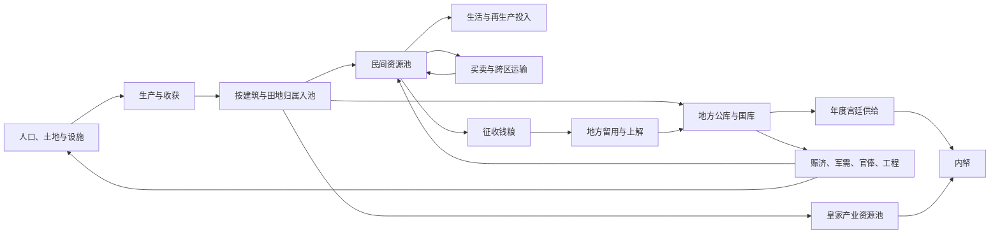

# M05＋M06：财政与地方经济联合框架 v0.2

> 2026-09-10 分类说明｜系统设计依据：正文保留已确认规则、候选方案与当时实施状态，不能整篇视为已经实现。 [当前实现核对](../../00_项目总览/系统索引与实现状态.md) · [工作文件总入口](../../README.md) 人口细则以[2026-09-09 职业人口规则](M06_人口职业与收入.md)为准。

> 2026-09-09 人口更新：取消年龄组，采用职业与收入财富双维度、50% 劳动力比例以及自然出生／死亡；人口相关旧提案以[人口职业与收入](M06_人口职业与收入.md)为准。

> 2026-09-08 实现状态：一县演示已完成生产、资源池、群体消费、人口后果、旬末存档及县页；正式平衡、全国和完整财政仍待扩展。下文保留设计与原实施计划，当前操作及实际脚本见[县级经济试玩说明](../../03_试玩与验收/M06_县级经济_试玩说明.md)。

更新：2026-09-07。用户暂缓 M04 机构与官职作用的设计，先讨论财政与地方经济框架，再回到官制分工。最新暂定基层州县、府州级、更大区域级的三级经济结构，县级八组属性及人口、土地的首版细化方向、[生产经营架构](M06_生产经营.md)已获同意，详见[县级属性讨论稿](M06_县级属性.md)。当前进入[钱粮、物资与居民消费](M06_钱粮物资与消费.md)。本稿未修改运行代码；新展开细则、公式、具体经济群体及结算算法仍待讨论。

## 1. 设计顺序

建议先确定地方经济中有哪些主体和资源、资源怎样生产与流转，再确定税制和财政收支，最后把办理责任映射给 M04 的机构官职。

| 方向 | 本轮要解决的问题 | 后续可以支持的玩家决定 |
| --- | --- | --- |
| 地方经济基础 | 人口靠什么生活，土地、劳力和设施怎样支持生产 | 移民、开垦、生产与建设方向 |
| 生产与生活 | 产出、日常消费、种粮与生产投入、灾害和积累 | 发展与维持生活之间的取舍 |
| 市场与运输 | 谁出售、谁购买、交易价格、跨地区运送 | 购粮、调粮、贸易与交通建设 |
| 征税与财政收入 | 对什么征税、谁缴纳、怎样征收、如何留用和上解 | 减免、催征、调整负担与财源 |
| 支出与任务 | 官俸、军需、赈济、工程、宫廷供给等怎样占用资源 | 支出优先级、开工、停工和缩减 |
| 官员与信息 | 谁自主办理、哪些需要奏请、皇帝能知道多少 | 委派、追问、调查、调整政策 |

人口、粮食、土地等是世界状态；国库余额是国家可支配资源的一部分。地区繁荣、税收能力和国家财政各有含义，相关指标通过真实生产、交换和征收连接。

## 2. 延续的已确认边界

- 最新暂定基层州县为最小经济单位，向府州级、更大区域级组成三级结构，先讨论一个县。它取代此前省／州为最小单位的方案；具体州的层级、直隶例外和最高一级名称以后核定。用户已同意县级八组属性：人口、土地、当地特产、当地修正、钱粮与物资、基础设施、生产经营、民情与秩序；具体细分口径和公式继续设计。
- 地方官在没有皇帝逐项指示时，仍依据政策、法律、自身能力、性格和所知信息自主处置，带有少量随机性。
- 国库与内帑分开。内帑收入包含年度宫廷供给定额、皇家产业收益、临时进项；年度供给每年朝议，暂定一年一拨。
- 特定享乐宫殿的国库划拨沿用已确认的财政主官阻止和继任重审规则。经济模型负责提供相关财政状态，不改变该限制。
- 世界真实状态、官员所知与皇帝所知分别处理。提高情报质量不会增加真实钱粮，也不自动扩大办理权限。
- M03 仍按整旬活动规划推进。经济中的季节、收获或运输节点不要求玩家恢复按天安排皇帝活动。

## 3. 地区需要保存哪些内容

以下候选数据首先落在县级基础单位；上级汇总辖区数据并管理自身事务，不再按汇总人口和土地重复生产。上级自身库存与辖区汇总库存分别处理，具体分工见[县级属性讨论稿](M06_县级属性.md)。

建议区分持续积累的存量、每段时间发生的流量，以及决定生产能力的条件：

| 类型 | 候选内容 | 用途 |
| --- | --- | --- |
| 人口与生活 | 总人口、可用劳力、粮食需要、迁入迁出 | 决定生产与生活负担 |
| 生产条件 | 耕地及地力、水利、道路、生产技术、行业规模 | 决定产能与运输条件；土地和劳力不直接当作钱粮库存 |
| 民间存量 | 民间钱财、存粮、种粮及生产物资 | 维持生活、交易、缴税和再生产 |
| 公有存量 | 地方公库钱粮、国库钱粮、专用物资 | 供公共支出使用，由 M05 统一管理对应账目 |
| 本旬流量 | 收获、消费、交易、税款、支出、运输到货 | 解释本旬变化从何而来、去了哪里 |
| 派生展示 | 粮食可支撑多久、负担水平、收入趋势、财政缺口 | 帮助玩家比较方案，计算方式待定 |

经济主体建议先按地区内的群体表示，候选包括农户、土地持有者、工商业者；具体划分未定。不同群体可以承担不同税负和受到不同政策影响，无需本轮先决定逐户或逐人模拟。

首个可运行范围建议先把钱与粮分别核算，完成农业和财政循环；其他商品、生产链、银钱兑换与阶层差异分阶段扩展。这只是实现顺序建议，尚未决定删除工商业等后续系统。

## 4. 从生产到财政的流转

图表示候选资源联系，不规定所有税必须先入同一个地方仓库，也不把箭头当作无条件自动转账。具体实物、货币、直运或折纳路径需要逐项确定。

建议每笔交易或划拨都说明出方、入方、资源与数量。民间买卖、缴税、官府采购、跨库调拨是不同流程；借款、铸币、外部贸易等额外来源如以后加入，也要明确来源和边界。商品产值可用于经济统计，不直接变成新增货币余额。

粮食生产按季节或作物阶段积累进度，在收获节点入库；人口生活和驻军等按旬消耗。种粮、损耗和受灾对象分别记录，减少预期收成与毁损已有粮仓分别发生，不重复扣同一损失。首版作物、收获次数和地区差异仍待选择。

跨地区调运建议记录出库、在途、到达和损耗；在途粮不能同时留在出发仓并出现在目的仓。采购需要当地存在可出售资源及交易条件，有采购资金也仍可能缺货或来不及运达。

## 5. 税收与财政怎样结合

### 5.1 税收

一项税制至少需要明确：征收对象、计税依据、应纳数量、缴纳形式、征收时点、征收流程及去向。田赋、商业相关税收、专卖或其他财源可以作为后续候选；正式采用的明代税制与名称要再做专题核查，本稿不把统一税率公式视为历史制度。

建议分别记录应征、实征、欠缴、减免、地方留用、起运和中央实收。合理留用、未收欠税、违法截留和运输损耗分别产生后果；不统一归成一个“腐败百分比”。实征与去向应能核对，账报是否真实由 M07 表达。

### 5.2 支出

每笔支出建议明确用途、所需钱粮、付款账户、执行地点、开始条件、持续时间及负责方。可分为持续性支出、工程承诺、应急支出和宫廷供给，具体目录未确认。

预算获批、实际付款和任务完成分别记录。按用户最新简化，钱粮不设预留或占用余额；工程按阶段实际需要直接从对应资源池扣除，余额不足时再处理阶段缺口。收到拨款不直接等于建成，投入劳力也可能与农业等活动争用同一批劳力。

财政评价建议同时看现有存量、近期可收到的收入、已承诺支出、拖欠项目和资源所在地点。年度应拨的宫廷定额单独记录实际拨付情况，保留年度商议与一年一拨的规则，不改成每旬自动分成。

## 6. 决策如何产生持续后果

以下都是供设计和验证的因果链，具体强度与阈值待定：

- 增加征收压力可能提高短期实征，但会占用民间生活或再生产资源；征不到的部分形成欠缴，不能直接记入国库。
- 灾害导致某地减产，民间储粮随后承压；余粮、市场和交通条件决定粮价及能否补足缺口，后续可能影响健康、迁移和社会稳定。
- 兴修水利先消耗资金、物资与劳力，建成后才改变相应生产条件；选错地点或执行不佳会影响实际效果。
- 增兵产生持续的粮饷和补充负担；在有足够制度与运输条件时，支出会转化为相应人员收入或物资供应。

这些链条让玩家的政策通过地方经济产生反馈。民心、政府声誉及个别官员关系的影响按所属规则另记，不能仅从账面收支正负推导全部政治结果。

## 7. 官员、情报与结算的衔接

建议地方官在既定职责和授权范围内办理日常征收、仓储、维护与救急，重大或超权限事项再呈报。具体自主权限留到 M04 设计。皇帝介入时修改或接续同一个事务，避免官员自办与皇帝指派重复支出。

每旬经济结算建议使用明确的阶段：读取已生效政策、既有任务及各方所知情况 → 产生或更新处置计划 → 校验资源与权限 → 推进生产、消费、运输和支出 → 记录结果及汇报。详细先后关系另定，不能利用界面访问顺序改变谁先抢到资源。

收获、税期、年度预算和内帑年度拨款各按自己的时点触发；旬是统一推进和观察的节奏，不要求所有收入都平均分成每旬到账。

皇帝页面建议呈现“账报数值＋报告时点＋来源或可信说明”，同时列出本旬主要变化原因与待决定事项。内部真实状态用于执行校验，不能因查询页面直接泄露地方未知存量。

## 8. 可以怎样分模块实现

| 模块 | 拥有的数据／结果 | 拟新增脚本（尚不存在） |
| --- | --- | --- |
| M05 | 国库、内帑、地方公库账目；征收与收支记录、承诺及拨付 | `core/finance/accounts.py`、`revenues.py`、`expenditure.py`、`transfers.py`、`annual_supply.py` |
| M06 | 地区人口、民间存量、土地与产能、生产消费、市场运输状态 | `core/regions/models.py`、`production.py`、`consumption.py`、`markets.py`、`transport.py`、`local_governance.py` |
| M04 | 任职、职权、制度、对方案的态度与执行约束 | 沿用官制专题中的责任划分 |
| M07 | 官员观察、皇帝账报、信息误差与送达 | 观察和报告模块 |
| M03／M08 | 推进时点与中断；事件、工程等持续任务 | 统一回合协调与任务模块 |

`core/` 指 `src/dynasty/core/`。同一份公共库存只由 M05 保存；M06 引用它，民间资源的变化与财政转移协调提交。先用一个县验证生产和收支，再用两个县验证交易、运输与互助，加入府州及更大区域汇总后再扩展全国；这仍是实现顺序建议。

首轮建议验证：无人下令时仍能完成生产消费和既定征收；灾区能提出援助，出库粮在途后才到达；减免造成的财政变化与民间保留资源对应；工程不能超过可用钱粮与劳力；暂停和存读档不重复执行收获、支出或年拨。

人口与土地首版方向、生产经营架构已获同意，钱粮已采用建筑田地产出按归属入池、实际消费直接扣池且不设库存预留的简化方案，群体消费已确认共用民间池、短缺时财富越低惩罚与死亡率越高，并发生上层向下层转化，当前细化需求和后果，再衔接首批资源与单位、税制、支出和交易运输。当前方案不代表任何经济数值已实现。

首个实现目标现定为一县的生产、资源池、群体消费与人口后果；完整计划见[一县经济首版实现计划](../../02_开发实施/M05_M06_首版实现计划.md)。先接现有 M03 旬末及存档，再增加跨县、税制和官职职责。
