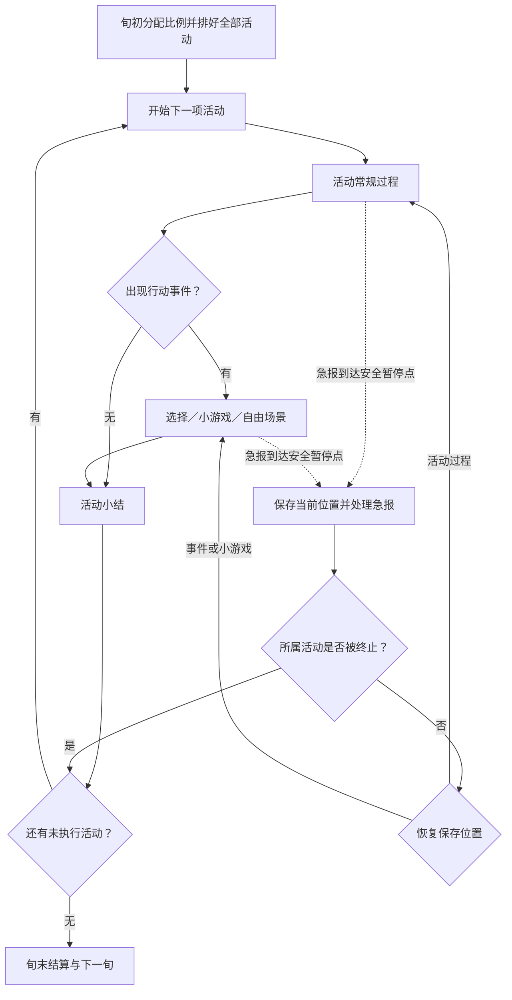

# M03：回合规划、顺序行动与事件草案 v0.4

> 2026-09-10 分类说明｜历史归档：保留当时方案与上下文，不作为当前实现依据。 [当前实现核对](../../00_项目总览/系统索引与实现状态.md) · [工作文件总入口](../../README.md)

> 试玩后规则修订：当前已采用“早朝 → 工作 → 私生活”三阶段，允许任务部分预排或临时选择，工作剩余时间可单向转为私生活。最新实际规则见 [三阶段行动说明](../../01_系统设计/M03_回合行动/M03_三阶段行动_试玩说明.md)。以下 v0.4 保留为前版设计对照，其交错排序和必须预排全部活动的条款已被替代。

更新：2026-09-07。所属模块见[框架草案](../../../王朝模拟_框架草案.md)。本稿记录新确认的回合体验及建议实现方式，当前尚未修改游戏代码。小游戏、自由活动场景和出游均为待扩展内容。

## 1. 本轮确认与设计目标

用户确认的顺序为：**旬初规划工作与私生活比例 → 排好全部具体活动及顺序 → 顺序执行 → 中途处理行动事件和紧急事件**。

具体活动在旬初决定，执行时主要处理事件。行动事件需要允许扩展小游戏、自由活动及出游内容。自由活动可以本身就是旬初安排的一项活动，进入后再选择去处与互动；不等于留下一段尚未分配的 AP。

最新修订：**早朝每项安排固定消耗 5 AP，可以处理多项事务，成本不随工作量变化；日讲每次 1 AP，普通私生活行动暂按每项约 1 AP。** 用户进一步明确，批阅章奏、召见臣工、处理宫廷事务继续采用“先分配时间（AP），再决定处理量”；不按事务件数或工作量反向计算扣点。处理效率与事务复杂度仍待设计。

新增确认：**时令、事件或准备条件产生的活动预先进入后续行动计划，到期由玩家选择执行、改期或不去；改期和不去产生相应惩罚。** 具体惩罚、改期窗口及自动排入时的冲突处理仍需设计。

时间基准已修订为 **暂按 10 天／回合、整旬共用 30 AP，不按天安排**。1 AP 约 4 小时只保留为粗略参考，不拆成每日额度或小时格。工作与私生活的 AP 分配可调整。历史参考、已确认点数及候选项见[行动点与时间规则](../../01_系统设计/M03_回合行动/M03_行动点与时间_建议.md)。

以下未标为确认的场景结构、中断细则与界面方案均为建议。保留原有每月三旬、健康影响 AP、当旬 AP 用完且不结转、诏书限制与应急透支规则；其余未确认参数不因此定值。固定成本／分配办公时间与活动来源是两个维度，预约活动也需要单独定义成本。

## 2. 旬初规划：先分预算，再排完整日程

建议规划页分两步，但可随时往返调整，点击开始执行前才统一校验。

### 2.1 分配工作与私生活

先确定本旬用于工作的行动预算与私生活预算，再填入具体活动。用户可以修改两类预算的分配，例如工作 20／私生活 10，或工作 15／私生活 15；两类合计仍为 30 AP。比例不单独产生政务效率或心情加成，也不改变活动单价，具体效果来自真正执行的内容。

新设计只检查整旬预算与活动顺序，不设置每日 3 AP 的额度或逐日排程。规划页按各类活动固定成本或玩家分配的 AP 计算比例，不按卡片张数计算。最小分配单位与健康减损公式仍待确定。当前代码仍是每旬最多 3 AP、每项活动 1 AP 的旧原型，尚未改用新量表。

工作与私生活的活动目录建议如下，不先规定必须维持某个最低工作比例：

| 分类建议 | 可选活动举例 | 注意事项 |
| --- | --- | --- |
| 工作 | 早朝、批阅章奏、召见臣工、处理宫廷事务、日讲，以及待选的巡视等 | 早朝固定 5 AP，日讲每次 1 AP，办公三项先分配 AP 再决定处理量；工作身份与朝政覆盖资格分开 |
| 私生活 | 休息、个人读书、习武、书法、陪伴家人、宫苑活动、自由活动、出游 | 普通行动暂按每项约 1 AP；长途等特殊行程另定，学习、恢复和社交也可归入私人安排 |

活动分类以目的为依据：个人习字与主持官方文事、游玩与公务巡视可以共用部分场景，但不是同一日程活动。首次实现先使用少量明确分类的活动，不用分类切换规避诏书或其他成本。现有 `study`、`exercise` 等具体归类仍可讨论。

### 2.2 排定活动与顺序

每个活动卡片确定活动名称、工作／私生活归属、计费方式、AP 成本或预算及必要参数，例如待处理事项、召见对象或出游目的地。活动尚可包含内部选择，不必在旬初预知所有事件。

玩家可拖动排序，也可工作与私生活交错。以下仅示意顺序，不预设三项成本相等：

> ① 早朝〔工作／固定 5 AP〕 → ② 宫苑游赏〔私生活／暂按 1 AP〕 → ③ 召见臣工〔工作／预分配办公 AP〕

开始执行时，所有具体活动及顺序均已确定，固定成本与办公分配 AP 合计占满本旬预算，工作／私生活分配与所选比例相符。规划时预留 AP，执行时记录时间的实际消耗；处理数量属于这段投入产生的结果。三旬计划逐旬检查，不把三旬 AP 合成一个池子。

建议启动后按该日程执行，普通事件的选择不重新打开整旬活动选择器。紧急替换、目的地不可达、健康或资源变化等导致原计划失效时，暂停并展示影响，允许玩家明确处理未开始部分；是否允许任意主动重排，留待后续决定。

### 2.3 固定成本与可分配办公时间

| 类别 | 已确认活动 | 计费规则 | 尚待设计 |
| --- | --- | --- | --- |
| 固定成本 | 早朝、日讲、普通私生活行动 | 早朝每项安排 5 AP，日讲每次 1 AP，普通私生活暂按每项约 1 AP；早朝可以处理多事 | 实际开始／中止时的收费节点、可安排频率、特殊私人活动成本 |
| 按投入时间计费 | 批阅章奏、召见臣工、处理宫廷事务 | 玩家先分配 AP，再按投入时间与效率决定可处理工作量；不逐件追加收费 | 最小分配单位、处理效率、事项复杂度及技能的具体作用 |

早朝的固定成本是有意保留的机制。不能另加按议题数量递增的 AP、隐藏工作量上限，或为了平衡强制把后续议题转为付费批阅。正式政令仍遵守既有诏书、CD、财政与权限规则；单纯听取奏报、谈话不因此被一概认定为消耗诏书。

办公活动建议在旬初选择类型、对象／待办范围及优先顺序，并分配本段 AP。规划页可预估能处理多少，执行中按实际结果推进；新增事务可进入待办，不自动挤占私人安排。普通对话点击不是独立计费单位，现实游玩时间也不直接换算为游戏 AP。早朝 5 AP 是整旬活动列表中的抽象安排，不表示连续召开 20 小时，也不再展开为十场每日早朝。

建议用“可处理工作量 = 投入时间 × 处理效率”作为解释框架，具体公式未确认。事项可有不同复杂度并允许跨时段推进；投入更多时间主要增加可办数量或进度，不自动保证重大案件判定成功。按 M01 原则，相同技能、修正及其他条件下常规表现相同，基础属性不另加普通办公效率；它们继续影响学习及特殊事件判定。

为兼容旬初完整预排、办公时间预算和可调整分配，建议采用以下细则，尚未作为确认结论：

1. 规划时显示已分配 AP 及预计处理量；预留 AP 不立即记作已消耗，执行按完成的游戏时段记账，不按事务件数再次收费。
2. 本段时间结束后，未处理的事务或未完成部分留待后续；玩家可以优先处理紧要事项。待办有自己的期限和积压后果，顺延待办不自动等同于缺席预约。
3. 想继续办公时，须明确调整尚未开始的活动或工作／私生活分配，才能增加本段投入；不能透支 AP、自动延时或挪用已完成活动的时间。
4. 已投入时间不因办成事务少、判定失败、反复查看或修改比例而返还。若待办提前清空，玩家可选择继续相关工作，或提前结束并重新安排真正尚未使用的时间；是否允许提前结束及最小结算时段待定。实际未用 AP 仍须在本旬安排完，不结转或无声消失。
5. 同一处理步骤只记录一次进度与结果；早朝已处理完的事项不在批阅队列重复完成。追加审阅、调查或再次召见是不同工作过程。朝会议题、事务步骤、对话点击和整项活动的目标计数分别定义，不把每点 AP 自动当作完成一次活动。

### 2.4 未来预约：提前排入，到期选择

已确认的预约来源包括时令、事件与准备条件。例如礼制日期形成祭祀安排，使团来访形成接见安排，已启动的出行准备形成后续行程。具体哪些候选活动采用该机制尚待逐项选定，不自动把所有私人愿望变为带惩罚的义务。

建议在连续三旬计划之外保留未来日程，能够容纳更远的活动；进入对应旬时将预约带入本旬规划，玩家再处理其他活动及工作／私生活比例。预约创建本身不提前扣未来 AP；筹备中已实际发生的钱粮、人力或其他投入由相应模块另外记账。

每条预约建议显示活动名称、来源、原定旬、当前执行旬、准备状况、预计 AP、相关人物，以及改期／缺席的可知后果。到期提供三种选择：

| 到期选择 | 已确认方向 | 具体处理建议 |
| --- | --- | --- |
| 执行 | 按安排参与 | 执行前重新校验 AP、健康、地点与准备条件，再进入有序活动列表 |
| 改期 | 改到后续计划，并产生相应惩罚 | 玩家选择新的时点，重新检查冲突；保留原日期、变更历史及已发生后果 |
| 不去／缺席 | 不执行，并产生相应惩罚 | 记录未履约事实及后果，不把删掉计划卡片当作无代价取消 |

惩罚应按事务内容设计，以下仅为候选：祭祀或典礼改期可能引起礼制争议和臣属不满；接使延期可能损害对方信任并增加接待成本；阅兵或巡幸变更可能造成已投入筹备的损耗；殿试等延误可能拖延后续取士流程。轻重可参考提前量、已经投入的准备、相关人物与制度，以及变更理由；具体公式、是否存在免责理由尚未确定。

预约插入已排满的未来旬时，建议显著标记冲突，让玩家调整相关未执行计划、改期或缺席，不自动覆盖私人活动。系统造成的重复条目或安排冲突本身不直接生成罚款；玩家选择改期／不去，或未处理直至错过到期点时，才按定义处理后果。

改期沿用同一预约 ID，原条目留变更记录，只有新的执行安排生效；每次改期可以产生其定义的后果，但刷新、反复打开或读档不能重复惩罚同一次选择。再次改期不重置原始期限或抹去历史；时令活动改到原窗口之外时应表达延期／补办及相应损失，不擅自改变世界的节令。

多个预约冲突、准备迟到、病重或急报迫使改期的情况需要具体规则。已确认存在改期与缺席后果，不先把所有情况写成相同的忠心扣分，也不默认各种理由都能免罚。

## 3. 顺序执行：每项活动有开始、过程和结束

图中的恢复回到原有进度，不从活动开头重新执行；若中断发生在小游戏内部，应回到该小游戏的保存阶段。

建议执行页始终显示整旬日程、当前活动、已完成及被终止的活动，中心区域呈现当前行动内容。没有交互的常规过程可以继续推进；需要玩家决定时停下。活动不必每次强制触发事件，也不要求每项活动都有小游戏。

早朝活动中仍可处理多个政务事项，AP 保持固定 5 点；每项正式命令分别检查诏书与 CD。其他三类办公按玩家分配的 AP 推进，不能沿用“所有政务活动都收一次固定 AP”的总括说法。重复安排工作不恢复本旬诏书额度。普通政令在实际执行到、且具有相应办理权限的活动中开放；批阅和召见的具体发令范围、是否计入急报朝政覆盖仍待确定。

## 4. 行动事件：给预排活动增加可玩的过程

行动是日程中的一项安排；行动事件是这项安排内出现的遭遇与选择。它可以采用不同表现形式，M03 只负责进入、暂停、恢复和接收结果。

| 场景形式 | 示例 | 结束后的去向 |
| --- | --- | --- |
| 文本选择／对话 | 朝议中的争执、召见中的请求、读书时讨论观点 | 返回所属活动，或触发后续事务 |
| 小游戏 | 习武中的射艺、书法练习、对弈 | 返回所属活动并记录本次结果 |
| 自由场景 | 宫苑散步时选择路线、人物或互动 | 在该场景范围内继续，结束后返回日程 |
| 出游过程 | 选择预定行程中的去处，遭遇天气、民情或随行人物事件 | 结束当前行程阶段，或提出新的日程需求 |

小范围游赏可以作为一项活动；跨旬远行应由持续任务管理行程，各旬安排相应活动，不把长途出游塞成无限时长的一项免费行动。具体距离与时长以后设计。

普通界面点击、对话推进和小游戏操作不逐次另收 AP；办公活动在已分配的时间内推进事务，行动事件如何占用这段时间由活动规则定义并明示。私人场景设置有限的阶段、机会或明确结束条件，不能无限刷学习、金钱和关系；这不构成早朝的额外工作量上限。若选择会延长行程或明显占用额外行动，应明示对后续未开始安排的占用／替换及资源需求，由玩家决定；不挪用已完成活动的时间。

个人场景里遇见请托、案情或灾情，可以产生后续政务，但不会自动开放普通朝政发令权限；真正升级为急报时，走紧急事件规则。事件的来源与紧急程度是两个维度，行动事件也可能升级为紧急事件。

小游戏建议提供手动游玩及按角色能力自动处理的入口，适用活动也可允许离开；是否损失机会或获得何种结果由事件明示，避免每次学习都强制玩家重复小游戏。具体自动结果与手动玩法平衡待定，不预设手动必然获得额外奖励。

人物能力仍沿用 M01：相同技能、修正及其他条件下，常规表现相同；特殊事件才结合相关基础属性与技能判定。小游戏中的玩家选择、操作表现如何进入事件结果，另行设计，不能悄悄把所有正常活动改成依靠玩家手速或高基础属性加成。

## 5. 紧急事件：插入日程，同时保留恢复位置

紧急事件到达可暂停的位置时，先保存当前活动、事件或小游戏进度，再展示急报。玩家思考和游玩的现实时间不自动推进游戏日历；世界按约定的游戏阶段运行。

| 当前日程状态 | 保留的规则与建议处理 |
| --- | --- |
| 当旬有朝政安排，尚未执行 | 急报不额外消耗 AP；处理后恢复当前活动，未来朝政仍按计划执行 |
| 当旬朝政已经完成 | 急报仍不额外消耗 AP；不重新发放朝政收益，也不恢复普通政令额度 |
| 当旬没有朝政安排 | 玩家终止一个当前或未来尚未完成的活动，不返还 AP；不能取消已完成活动 |
| 被终止的就是当前活动 | 结束该活动及内部场景，不给予其完整完成收益；处理后推进剩余日程 |
| 被终止的是未来活动 | 当前活动暂停，处理后恢复；未来被终止的活动在执行时跳过 |

“当旬具备朝政覆盖”与“此刻正在朝政、可以发普通命令”分别判断。只分配工作预算，或安排了不具备朝政资格的工作，不自动获得急报的 AP 豁免。

引入不同固定成本和可分配办公时间后，终止活动仍不能返还已实际消耗的 AP；其尚未使用的预算如何被急报占用，以及固定成本活动中止如何收费，需要补充细则。不能因为卡片成本不同就擅自允许 AP 透支、追加一个完整活动成本或改成必须牺牲多项活动。

仅关联急报的适用回应可以透支诏书，减少下一旬可用量；不能借机发无关普通政令。活动中止已有多少进度、消耗和中间成果，按活动规则处理，暂不统一承诺全部退还或全部抹除。

建议正常事件检查放在活动阶段完成提交之前；全部活动完成并提交旬结算后出现的新急报，归下一旬送达。无朝政且已无可中止活动时，如何排队／延后，以及连续多个急报如何计替换成本，仍是待定边界，不能通过赠送 AP 或追溯取消已完成行动解决。

## 6. 活动小结与旬末结算

建议区分以下时点，避免把每次小游戏结束都当作过完一旬：

- **事件回应提交**：正式政令、已经发生的支出和事件结果各按明确时点提交一次，保存后恢复不能重新扣除或重新抽取结果。
- **活动完成**：标记该活动完成，显示小结，保存可供成长和目标系统使用的完成记录；被中止、仅暂停的活动不计完整完成。
- **旬末完成**：运行本旬世界结算、汇总人物目标，并把按旬持续的短期修正递减一次；检查下一旬健康与 AP、诏书及计划。

为兼容当前规则，首轮方案建议 M02 的正式目标进度仍在成功旬结算时汇总，只接收目标创建后实际完成且尚未计入的记录；活动小结可以提前展示本次完成事实。若以后改为每项活动完成即正式满足目标，须明确这是结算时点变更，并同步调整存档校验，不能只改 UI。

学习增长、健康及压力等效果究竟在活动结束还是旬末正式生效，须与 M01 的机制一起确定。过程中因事件立即改变健康时，不应清除已完成记录；剩余日程的 AP 如何调整需要单独规则，当前代码会拒绝与既有安排冲突的手动健康修改。

## 7. M03 的实现分工建议

当前 `src/dynasty/core/session.py` 尚无逐项活动执行游标：`advance_turn()` 先处理预排政令，再一次性把未被替代的活动标为完成。因此新方案需要增加真正的活动执行过程，不能只在旧按钮前插入动画或弹窗。

当前 `Activity.cost` 虽有字段，但 `set_activities()` 只接受成本等于 1，计划主要保存活动种类；因此早朝 5 AP／可分配办公时间、办公效率、远期预约、改期与缺席后果均未实现。设计基准已改为整旬 30 AP 且不按天安排，但运行代码的 3 点演示值尚未迁移，不能直接解释成新办公处理量。

| 责任 | 现有位置 | 建议拆出／新增位置（尚不存在） |
| --- | --- | --- |
| 比例、活动完整性与顺序 | `core/models.py` 的 `Activity`／`TurnPlan`；`core/session.py` 的安排方法 | `core/turns/planning.py`，保存有顺序的具体活动及分类预算 |
| 固定成本与分配办公时间 | 当前仅接受每项 1 AP | `core/turns/action_costs.py`，区分分配 AP、实际已用 AP 与处理进度，结果统一提交 |
| 未来预约与改期 | 当前仅有连续三旬计划 | `core/turns/appointments.py`，保存来源、原期、现期、准备情况、冲突及变更历史 |
| 当前活动与执行阶段 | `core/session.py` 的 `start_turn`／`advance_turn` | `core/turns/activity_runner.py`，提供开始、继续、完成与终止入口 |
| 整旬协调与提交 | `GameSession` | `core/turns/coordinator.py`；保留 `session.py` 兼容入口 |
| 急报暂停与恢复 | `resolve_emergency`、`EmergencyEvent` | `core/turns/interruptions.py`，保存返回位置并管理替换 |
| 事件内容与玩法入口 | 当前只有演示急报 | M08 的 `core/events/`；可逐步新增 `core/activities/` 放活动内容，`ui/activities/` 放场景与小游戏界面 |
| 规划与执行页面 | `ui/main_window.py`、`ui/dialogs.py` | `ui/planning_page.py`、`ui/activity_page.py`，公共日程展示复用同一状态 |

本表 `core/`、`ui/` 均相对 `src/dynasty/`。比例控件、场景界面不直接改写整个游戏状态。

M03 向活动内容提供所属活动、相关人物／地点、当前阶段与允许操作。内容返回“继续、等待选择、完成、请求终止”等状态及待提交结果；成长和判定交给 M01，目标交给 M02，账户交给 M05，自然事件和长期任务交给 M08。

存档需要保存整旬日程、当前活动位置、已完成／被替代记录、当前事件、小游戏局部进度、急报后的返回位置及哪些结果已提交。需要多层暂停时保存实际层级，多个待处理急报优先排队；不能仅用一个全局 `interrupted` 标记代替全部内部进度。

新增存档范围还包括待办清单与工作进度、各活动分配 AP、实际已用 AP、未来预约与变更／惩罚记录。M03 管整旬日程和执行顺序，M08 提供触发来源与活动内容，M04/M05 等模块计算并提交所属的关系、政治或资源后果；日程页面不自行改写各模块指标。

## 8. 第一版验证范围与下一轮讨论

供继续挑选和改名的具体条目见[皇帝活动目录候选](../../01_系统设计/M03_回合行动/M03_活动目录_候选.md)。早朝、批阅章奏、召见臣工和宫廷事务已确定计费方向；其余条目的取舍和条件性活动细则仍待选择。

建议先完成三项代表活动：处理朝政、带一个简单互动的个人活动、具有少量去处选择的自由活动。先验证执行结构，再分别添加具体小游戏和出游内容。

必须能走通：旬初分比例并排完整日程 → 按顺序进入各活动 → 行动事件返回原活动 → 小游戏或自由场景中插入急报 → 按朝政覆盖／活动替换规则处理 → 准确恢复或终止 → 旬末只结算一次 → 存读档后保持同一执行位置。

新增验证场景：整旬共 30 AP，不生成每日 3 AP 排程或校验；早朝固定 5 AP 且不随事务量改变，日讲每次 1 AP、普通私生活暂按每项约 1 AP；工作／私生活预算可修改且总量守恒；三类办公先分配 AP，再按效率推进处理量，不逐件二次收费；预留与已用不混淆；同技能同条件普通办公表现相同；未完事务保留待办、不暗中占用私人预算；远期预约到期可执行／改期／缺席；改期保留同一来源、不重复执行或重复处罚；AP 冲突可解释并处理。尚待讨论：AP 最小单位、健康减损、处理量与效率换算、频率与特殊成本、朝政覆盖资格、预约冲突与惩罚、执行中改排、小游戏自动处理、中止收益及多急报边界。
