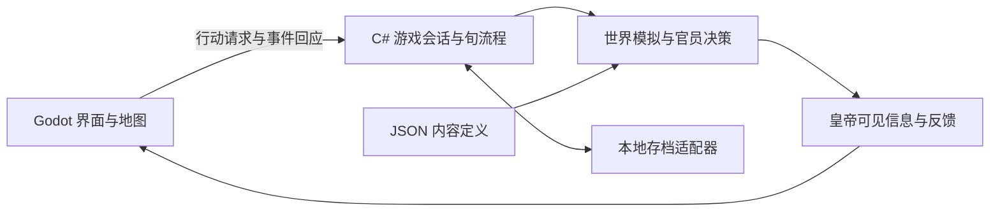

# 王朝模拟游戏：技术方案草案 v0.1

> 2026-09-10 分类说明｜历史归档：保留当时方案与上下文，不作为当前实现依据。 [当前实现核对](../00_项目总览/系统索引与实现状态.md) · [工作文件总入口](../README.md)

状态：待共同确认。整理日期：2026-09-07。

本方案基于已讨论的玩法框架，补充开发技术与实现方式。技术选型尚未确认，目前只有设计文档，尚未安装开发依赖、创建引擎项目或编写游戏代码。本轮暂停新增玩法细节。

## 1. 推荐方案及前提

在“首版 Windows 单机、以二维界面和省／州地图为主、由个人或小团队持续扩展”的假设下，推荐：

**Godot 4 稳定版的 .NET 版本 + C# + 独立模拟模块 + JSON 内容配置与本地存档。**

上述平台、画面形式与开发参与方式是选型假设，尚待用户确认。Godot 支持由 Control 节点、布局容器和主题构建界面，可以用于朝政、奏报、人物与计划面板。[Godot 官方 UI 文档](https://docs.godotengine.org/en/stable/tutorials/ui/index.html)

选择 C# 的项目判断：本游戏的复杂度主要集中在数据关系、跨旬任务、规则组合与存档恢复。将这些逻辑写成不引用 Godot 的 .NET 类库，便于独立测试和长期维护；Godot 项目负责显示、输入、音效和资源加载。这是一项架构建议，不是已经完成的性能验证。

Godot C# 开发需要 .NET 版本的编辑器及独立安装的 .NET SDK；正式建项时选定相互兼容的稳定版本并固定，避免开发中自动追随最新版本。[Godot 官方 C# 文档](https://docs.godotengine.org/en/stable/tutorials/scripting/c_sharp/c_sharp_basics.html)

**会改变推荐的平台条件：**截至本次核对，Godot 官方稳定版文档仍注明 Godot 4 的 C# 项目不能导出网页。如果浏览器直接游玩是首要目标，需要先改选路线，不能把网页发布当作该方案现成具备的能力。[Godot 官方网页导出文档](https://docs.godotengine.org/en/stable/tutorials/export/exporting_for_web.html)

| 路线 | 适用情况 | 本项目的取舍 |
| --- | --- | --- |
| Godot 4 .NET + C#，推荐候选 | 优先做桌面单机，希望有完整游戏界面、地图和后续视听表现。 | 核心可以用普通 C# 独立运行；需要学习引擎编辑器与 C# 工具链。 |
| TypeScript + React + Vite，网页候选 | 希望直接通过浏览器试玩，内容主要是界面、数值和二维地图。 | 可以沿用分层设计思路，但模拟核心应改用 TypeScript；不假设未来能直接复用 C# 代码。 |

网页候选使用 React 组织界面、Vite 提供开发和构建流程；是否采用该路线取决于首发平台。此处仅作为比较，不同时搭建两个客户端。[React 官方建项说明](https://react.dev/learn/creating-a-react-app)、[Vite 官方入门说明](https://vite.dev/guide/)

## 2. 首版技术组成

| 部分 | 推荐技术／方式 | 目的 |
| --- | --- | --- |
| 游戏客户端 | Godot 4 .NET；Control 界面与二维地图节点 | 展示国家、地方、人物、奏报、行动安排和事件。 |
| 模拟核心 | 独立 C# 类库，普通数据对象与明确的处理模块 | 负责世界状态、决策、命令、旬结算与恢复流程，不依赖画面帧率。 |
| 内容配置 | JSON 文件，加载为带类型的 C# 数据 | 朝代开局、人物初始数据、特质、政务、政策、事件和基础参数。 |
| 存档 | 带版本的 JSON 快照，使用 System.Text.Json | 保存完整运行状态，便于首版检查与调试。 |
| 官员决策 | 候选行动、条件检查、评分与少量受控随机 | 将性格、能力、政策和法律接入自主决策。 |
| 核心验证 | xUnit 与 dotnet test；批量模拟场景 | 验证跨旬账目、中断恢复、信息隔离和无人干预时的运行。 |
| 工程管理 | Git、固定工具与依赖版本、简短运行说明 | 保存变更、追踪问题，使项目能在另一台机器上重建。 |

System.Text.Json 提供 .NET JSON 序列化与反序列化能力；xUnit 可通过 dotnet test 运行独立测试。[Microsoft JSON 文档](https://learn.microsoft.com/en-us/dotnet/standard/serialization/system-text-json/overview)、[Microsoft xUnit 教程](https://learn.microsoft.com/en-us/dotnet/core/testing/unit-testing-csharp-with-xunit)

首版按单进程本地程序实现。内容读入内存后结算，本地文件负责存档。数据库、联网服务、账号与云存档等，待出现实际需求时再评估。

## 3. 核心如何与界面衔接

建议最初只划分三个工程：模拟核心、Godot 客户端和核心测试。核心内部通过文件夹与类划分职责，不为每个玩法系统建立独立服务。

| 核心模块 | 对应已有设计 |
| --- | --- |
| 世界与人物状态 | 国家、省州、皇帝、官员、健康、关系、政策和任务。 |
| 旬流程与月度计划 | 每月三旬、计划游标、活动状态、暂停和继续。 |
| 命令处理 | 普通诏书、紧急透支、CD、劝谏、部分委托与执行。 |
| 地方决策 | 官员在没有具体指派时继续处理事务。 |
| 政策与效果计算 | 能力、性格、法律、政府声誉等对措施与结果的影响。 |
| 观察与报告 | 官员所知、皇帝所知、情报与皇权可见性、腐败造成的信息误差。 |
| 内容与存档转换 | 读取定义，验证引用，恢复带版本的状态。 |

界面提交“调整税率”“回应劝谏”等请求，由核心统一检查与执行。界面接收的是经过信息规则处理的展示数据，不直接绑定地方真实存粮或隐藏事务。

省州和官员在核心中采用数据记录与稳定 ID。Godot 节点仅代表需要显示的地图或界面元素；关闭人物面板不会删除人物，也不会让地方模拟停止。

## 4. 回合、中断与诏书的实现

建议用明确的状态机记录本旬处于哪个阶段，例如：

`进入本旬 → 确定安排 → 执行动作 → 地方决策与结算 → 生成报告 → 本旬结束`

劝谏与紧急事件会进入“等待玩家回应”状态，保存待处理命令、关联事件、当前活动和恢复位置。弹窗只显示这个状态；游戏暂停不依赖弹窗是否打开。

- 月度计划调用相同的旬推进流程三次，每次读取最新健康、诏书债务、政策和地方状态。
- 每条命令具有稳定标识和提交状态。校验、劝谏、扣费、启动 CD、惩罚与任务创建按明确顺序执行。
- 需要等待劝谏选择时保存待提交草案；接受劝谏保持税率不变，坚持才正式提交相应变化。
- 诏书透支记录关联的紧急事件与回应，下一旬扣减一次；普通政令不会继承这项资格。
- 存档发生在一次完整状态更新之后，可以保存“正在等待回应”的状态，不保存只扣了一半成本的状态。
- 模拟时间由旬计数推进，不使用画面帧数或真实系统时间计算政策 CD。

这套流程也能容纳未来的私生活事件：新增活动与事件定义，接入同一行动力预算、人物状态和等待回应机制。

## 5. 官员与世界模拟的实现

首版官员使用可解释的规则评分：读取其掌握的信息，形成适用的候选行动，根据性格、能力、政策与法律计算偏好，再以少量随机性打破近似选择。行动选择与实际执行分开，官员判断很好也不代表资源必然充足。

法律是否可以违反、不同官职的权限等仍属于待定玩法。技术上提供这些条件与结果的接入位置，本轮不替用户固定规则。

人口、粮食和财政先作为省州的汇总数据模拟，具体指标仍待确认。皇帝、官员等重要人物单独建模；进一步模拟每位居民需要另行评估，首版先验证地区层面的规模与因果关系。

统一随机数模块需保存算法版本和当前内部状态，不能只保存初始种子。以稳定顺序处理实体与资源冲突，使同一规则版本、内容版本、输入及随机状态能够复现结果。财政与粮食账目建议采用明确的最小计量单位和统一舍入规则。

批量推进后记录每旬耗时、资源变化与主要原因，依据实际测量决定是否需要缓存或并行。首版模拟先按确定的顺序执行；视听更新与世界计算分别组织。

## 6. 怎样做到内容可扩展

必须分开“内容定义”和“运行实例”：

- 内容定义描述某种政务的参数、诏书成本、CD、劝谏条件和效果类型。
- 运行实例记录这一局中谁向哪里发令、花费多少、何时执行、是否被劝止及是否完成。
- 所有内容使用稳定 ID；名称、文本与美术资源可以修改而不改变对象身份。
- 启动时校验重复 ID、缺失引用、参数范围和必填字段，将问题定位到具体文件。
- 常见条件与效果用少量结构化字段表达，复杂执行逻辑仍写在 C# 模块中。

例如增加一位官员、一项既有类型的特质或一个朝代开局，主要增加配置。增加完全新的海运系统，则需要新增模拟代码，再通过接口接入结算。可扩展框架不能消除新规则本身的开发工作。

Godot 客户端负责读取打包资源并将 JSON 文本交给核心，核心不依赖引擎资源路径。首个桌面导出样例需要验证 JSON 内容实际包含在发布包中。

## 7. 存档与验证

存档建议包含：

- 存档格式版本、模拟规则版本与内容版本。
- 真实世界、人物、政策法律、持续任务与地方自主事务。
- 官员信息、皇帝信息及已发现的事件。
- 当前年／月／旬、阶段、活动状态与月度计划位置。
- 诏书使用、应急透支、CD 与政策变化历史。
- 待回应事件、劝谏和待提交命令。
- 随机数内部状态及必要的提交标识。

首版选择 JSON 快照是为了可检查性；数据量扩大后再衡量压缩或二进制的收益。JSON 的体积和类型表达有限，因此保存专门的数据对象，不直接序列化 Godot 的场景树。[Godot 官方存档说明](https://docs.godotengine.org/en/stable/tutorials/io/saving_games.html)

本地保存先写临时文件，写入成功并通过基本校验后替换目标，保留上一份备份。格式升级编写明确迁移；不能迁移的版本给出说明，不能静默加载为错误状态。

首批验证针对实际规则风险：

1. 同一操作序列下，整月规划与逐旬执行结果一致。
2. 急报与劝谏暂停后存读档，成本、惩罚、任务和结算不重复发生。
3. 普通命令不能透支，紧急债务在下一旬准确扣减。
4. 修改界面筛选、打开奏报不会改变随机结果或透露未知真值。
5. 皇帝不发令时，地方官仍运行；资源账目保持一致，长期模拟不存在无来源的增减。

这些是计划中的实现验收项，目前未运行游戏测试。引擎集成后可使用 Godot 命令行进行无界面启动与导出检查。[Godot 官方命令行文档](https://docs.godotengine.org/en/stable/tutorials/editor/command_line_tutorial.html)

## 8. 建议的落地顺序

| 阶段 | 交付与确认方式 |
| --- | --- |
| 技术确认 | 明确首发平台、开发语言与用户参与方式；选定兼容版本。 |
| 模拟骨架 | 少量测试省州与官员，跑通三旬、命令、CD、地方自主决策及日志。尚未定稿的数值使用明确标注的样例参数。 |
| 可操作原型 | 接入朝政、月度计划、奏报与事件界面，验证急报中断、劝谏和本地存档。 |
| 扩展验收 | 通过配置加入人物或既有类型事件；接入一个个人活动，验证私生活与政务共享行动力。 |
| 内容与表现 | 在骨架可运行后增加历史开局、经济机制、美术、音效及更完整的游戏流程。 |

## 9. 本轮需要确认

1. 首版主要在哪个平台游玩；Windows 桌面单机是否符合预期。
2. 用户已有的编程或引擎经验，以及希望亲自编写代码还是主要负责设计与配置。

技术推荐以这两项信息为依据调整。本轮不继续追问地方权限、经济指标等玩法细节。
