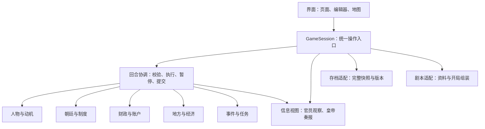

# 王朝模拟游戏：框架草案 v0.19 · 职业人口与收入

> 工作文档已于 2026-09-10 分类整理：[工作文件总入口](docs/README.md) · [系统索引与实现状态](docs/00_项目总览/系统索引与实现状态.md) · [系统设计模板](docs/99_模板/系统设计模板.md)。

更新：2026-09-07。本版归并已确认的县级属性、生产、资源池及群体消费，并将下一步开发调整为一县经济原型；同时按现有代码和[三阶段试玩规则](docs/01_系统设计/M03_回合行动/M03_三阶段行动_试玩说明.md)校正 M03 状态。**2026-09-09 更新：一县经济新增职业人口、收入财富分档、50% 劳动力折算与自然出生死亡，取消年龄组。** 人口规则见[职业与收入](docs/01_系统设计/M05_M06_财政与地方经济/M06_人口职业与收入.md)。 当前玩法与局限见[县级经济试玩说明](docs/03_试玩与验收/M06_县级经济_试玩说明.md)。 历史草案见 [v0.16 归档](docs/90_归档/框架草案_v0.16_归档.md)。

全文区分三种状态：**已确认规则**是共同确定的玩法；**当前实现**是代码已经具备的行为，其中演示参数不等于正式规则；**架构建议／待定**是后续方案。M03 和县经济已有拆分列为现有文件，其他目标脚本按实际开发创建。经济首版详见[实现计划](docs/02_开发实施/M05_M06_首版实现计划.md)。

## 1. 总体方向与当前基础

使用真实历史朝代作为开局，以皇帝的决策、个人生活和地方自主运转共同推动世界；后续发展允许偏离史实。经济层级最新暂定为基层州县、府州级、更大区域级三层，先以县作为基础单位展开；各类州、直隶例外与最高一级名称后续确定。一个月分三个回合，称上旬、中旬、下旬。最新暂定每回合按 10 天、整旬共用 30 AP，不按天安排，也不做每日 3 AP 校验；1 AP 约 4 小时仅作时间参考。工作与私生活共用预算，二者的 AP 分配可修改。真实历法的大小月与闰月以后处理。

推荐保留 **Python + PySide6 的单个桌面程序，在程序内部按模块分工**。各模块可以分别设计、编写规则和测试，由统一会话协调时间、资源和存档。现阶段不需要拆成多个进程或服务。

| 当前基础 | 已做到 | 仍缺少 |
| --- | --- | --- |
| 皇帝档案 | 13 项属性、6 项技能、健康、压力、身体异常、长短期修正、9 组性格、活动型欲望与野心；手动调整与存档 | 正式学习、事件判定、疾病演变、性格作用、自动生成动机与满足反馈 |
| 回合流程 | 30 AP、早朝→工作→私生活、阶段临选、工作余时单向转私人、场景与办公推进、急报／预约、v1–v3 存档分流 | 正式平衡参数、其他政务规则、真实世界结算 |
| 开局与资料 | 主菜单、开局参数、存读档、地图治所点、史料检索 | 按年代完整校验的剧本、完整运行人物与制度数据 |
| 世界模拟 | 独立清河县演示：有限投入、周期生产、三类归属池、职业与收入分档、三档消费、自然出生死亡、短缺惩罚、财富下降、县页及存读 | 全国初值、完整税制财政、官员 AI、情报、建设工程、迁移及军事 |

当前技术、运行方式及未决事项分别见 [技术方案](王朝模拟_技术方案.md)、[README](README.md)、[待确认事项](docs/00_项目总览/待确认事项.md)。史料工作基准约为 1500 年弘治十三年正月；治所点和跨年代行政索引不等于已经复原该年版图。

## 2. 模块总览与脚本对应

下面是未来分工的工作边界，不要求每个模块对应一个独立页面。路径均相对项目根目录；本节为便于阅读，`core/` 和 `ui/` 分别指 `src/dynasty/core/` 和 `src/dynasty/ui/`，`content.py` 指 `src/dynasty/content.py`。同一个现有脚本重复出现，说明它当前承担了多个模块的职责。

### 2.1 八个近期玩法模块

| 编号与模块 | 负责的内容 | 现有相关脚本 | 建议拆出／新增的脚本（尚不存在） |
| --- | --- | --- | --- |
| M01 人物能力与健康 | 属性、技能、成长、事件能力判定、健康、压力、身体异常、修正 | `core/emperor.py`；`core/session.py`；`ui/emperor_page.py`；`ui/emperor_status_dialogs.py` | `core/characters/attributes.py`、`skills.py`、`health.py`、`modifiers.py`、`growth.py`、`checks.py` |
| M02 性格与个人追求 | 九组性格、近期欲望、长期野心、完成条件及满足反馈 | `core/motives.py`；`core/emperor.py`；`core/session.py`；`ui/emperor_motives_page.py` | `core/characters/personality.py`、`objectives.py` |
| M03 回合、行动与诏令 | 三阶段、AP、诏书、场景、三旬计划、预约、命令和中断 | `core/models.py`、`session.py`；`core/turns/activity_runner.py`、`stage_runner.py`、`appointments.py`、`emergency_timing.py`；`ui/planning_page.py`、`activity_page.py`、`appointments_dialog.py`、`month_planning_dialog.py` | 保留现有入口，按经济接入需要增加旬末协调函数；通用 `coordinator.py`、诏书与命令继续按需拆分 |
| M04 朝廷、官员与制度 | 任职、任免、劝谏、办理权限、政策法律、政府声誉与腐败、官员执行规则 | `core/models.py`、`core/session.py` 的意图与流程；`ui/dialogs.py` 的任命入口；`content.py` 的官职／法令资料 | `core/government/offices.py`、`appointments.py`、`council.py`、`policies.py`、`execution.py` |
| M05 财政与皇帝财产 | 官府与皇家资源池、国库内帑、收入、支出、划拨与年度供给 | 县演示池在 `core/regions/models.py` 与经济状态中统一保存、按产权区分；正式财政未实现 | `core/finance/accounts.py`、`transfers.py`、`annual_supply.py`、`royal_estates.py`、`ui/finance_page.py` 按财政玩法接入 |
| M06 地方与经济运行 | 县级八组属性、人口土地、产业、资源池、群体消费、分层短缺后果与上级汇总 | `core/regions/models.py`、`production.py`、`consumption.py`、`population.py`、`economy.py`；`ui/county_page.py`；`data/config/county_demo.json` | 后续 `local_governance.py`、市场运输及多县汇总 |
| M07 情报与奏报 | 官员观察、皇帝已知信息、可见事务、信息误差、送达与调查 | `core/models.py` 的 `reports` 占位字段；尚无独立观察或信息过滤器 | `core/intelligence/observations.py`、`visibility.py`、`reports.py`；`ui/reports_page.py` |
| M08 事件与持续任务 | 自然事件触发、选项、长期工程与委派任务的生命周期 | `core/models.py` 的 `EmergencyEvent`；`core/session.py` 的演示急报；工程只记录意图 | `core/events/definitions.py`、`triggers.py`；`core/projects/tasks.py` |

拟新增列中仅写文件名的项，沿用同组首项的目录。以上为目标分工；文件可在规则增多时逐步提取，不必现在就把小规则拆成大量空文件。

M01 与 M02 共用人物档案，各自维护规则。M04 管官员职权、制度和通用执行判断；M06 管当地事务和自主处置。M08 管事件与任务内容，M03 管何时暂停、恢复和推进时钟。

### 2.2 两个远期预留方向

| 方向 | 边界与依赖 | 当前状态与拟新增位置 |
| --- | --- | --- |
| R01 宫廷、关系与传承 | 私生活、亲属、后宫、子嗣和继承；复用人物、性格、活动、财产与事件 | 已有 `private` 活动占位；关系及传承未实现。拟新增 `core/court_life/relations.py`、`household.py`、`succession.py` |
| R02 军事与对外事务 | 军队、战争、补给、外交；复用地区、财政、官员、任务与信息 | 军事策略技能已展示，战争系统未实现；外交仅预留方向，具体玩法未确认。拟新增 `core/warfare/`、`core/diplomacy/`，待玩法确定再细分文件 |

### 2.3 四项公共支撑

| 支撑 | 现有脚本与数据 | 建议边界及拟新增位置 |
| --- | --- | --- |
| S01 历史资料与剧本 | `src/dynasty/content.py`；`ui/launcher.py`；`data/history/`；`data/config/framework.json`；`tools/download_people_laws.py`、`tools/build_people_laws.py`、`tools/download_geography.py` | 将资源路径、史料读取、开局组装分开。拟新增 `src/dynasty/infrastructure/resources.py`、`history_repository.py`、`scenario_loader.py`；开局复制资料生成运行状态 |
| S02 存档与兼容 | `core/session.py` 的序列化及文件读写；`core/models.py`；`ui/launcher.py` 的存档列表 | 模块提供自身数据编解码，总存档统一版本与校验。拟新增 `src/dynasty/infrastructure/save_repository.py`、`migrations.py`；当前 v1／v2／v3 按原回合规则兼容，经济独立结构／规则版本 1、2 分别读取运行 |
| S03 界面与交互 | `src/dynasty/__main__.py`；`ui/main_window.py`、`launcher.py`、`dialogs.py`、`theme.py`、各皇帝页面与地图 | 主窗口装配导航和公共状态，各页面独立。拟新增 `ui/widgets.py` 提取公共控件；随玩法增加各模块页面与只读展示数据 |
| S04 验证与交付 | `tests/`；`tools/capture_previews.py`、`capture_emperor_status.py`、`capture_emperor_motives.py`、`verify_history.py`、`verify_history_people_laws.py`、`build_windows.py`、`verify_packaged.py` | 玩法单独验证，跨模块用例验证整旬、存档和完整操作；下载与构建工具不参与运行中的游戏结算 |

## 3. 各玩法模块的设计边界

### M01 人物能力与健康

**已确认规则**

- 基础属性变化缓慢：智力类为逻辑、情商、记忆力、洞察力、创造力；身体类为力量、体质、敏捷、感知、颜值；意志类为自律能力、情绪抗性、胆量，共 13 项。
- 技能可学习：政务处理、军事策略、识人能力、话术、书法、学识等。学习速度与相关基础属性及性格挂钩。
- 相同技能、相同显式修正及其他条件下，正常表现相同。基础属性不额外加成所有日常技能表现；事件判定将相关属性与技能共同计算，其他条件相同时高相关属性提高成功可能性。
- 基础属性不限制技能上限，保留玩家作弊与超出常规数值的空间。
- 健康栏包括整体健康度、压力，均为 0–100；只显示患病、残疾等异常身体部位。体质与当前健康是不同数据。
- 修正分长期与短期，可改变属性或技能效果；属性底值、技能熟练度和修正分别保存。

**当前实现**：`EmperorProfile`、`BodyCondition`、`EmperorModifier` 在 `core/emperor.py`。属性和技能可手动修改为非负整数，允许超过 100。当前属性修正按点数相加，当前值最低 0；技能效果由 100% 加百分比点，最低 0%，不改变熟练度。长期至移除，短期只在成功完成一旬后递减，暂停、失败、刷新和读档不扣期限。疾病名称不会自动生成惩罚；尚未运行成长和能力判定。

**分离建议**：本模块负责计算和校验，M03 决定活动是否真正完成并提交。健康变化还需由 M03 检查 AP 与已排活动／未来计划，不能由人物页面独立改健康而留下无效安排。当前整体健康在 `GameState.health`，压力和异常在 `GameState.emperor`；拆分时保持唯一健康值，迁移字段须兼容旧档。

**下一步讨论**：学习活动、成长单位、相关属性权重、技能量表、事件难度、健康与压力自然变化、疾病和修正来源。详见 [皇帝属性与技能](docs/01_系统设计/M01_人物能力与健康/皇帝属性与技能.md)。

### M02 性格与个人追求

**已确认规则**：采用仁厚—严酷、宽信—多疑、守成—求变、质朴—奢华、放权—掌控、谦逊—自负、重情—秉公、守信—权宜、合群—独处，共九组；“淡泊—好名”不采用。

不单列心理状态，心理影响进入已有压力、身体或修正。保留近期欲望与长期野心，由玩家完成以满足皇帝需求并提供游戏方向；性格如何影响可选操作、欲望产生和违背性格的代价，具体机制尚待确定。

**当前实现**：`core/motives.py` 定义九组性格和 `PersonalObjective`。性格暂用 0–100、50 居中的演示量表；玩家可设活动型目标。创建后的对应活动在成功旬结算中实际完成才计数，被替代活动不计，达标自动记录完成旬且不重复计数。未完成目标可撤下；不设一键完成或领取奖励，不自动改变压力、属性、财产。

**分离建议**：性格提供学习倾向、决策偏好等输入；目标系统接收实际完成结果。未来满足效果涉及压力或财产时，由对应模块校验后提交；不另建心理状态数值，也不让目标页面直接转钱或补 AP。皇帝的主观欲望与玩家选择分开，暂不新增未经确认的强制选项锁定。

**下一步讨论**：欲望来源、能否忽略、持续时间、野心的阶段条件、满足和未满足的反馈，以及性格在学习、官员态度和生活中的具体作用。详见 [人物性格与动机](docs/01_系统设计/M02_性格与个人追求/人物性格状态与动机_建议.md)。

### M03 回合、行动与诏令

当前采用[三阶段行动试玩规则](docs/01_系统设计/M03_回合行动/M03_三阶段行动_试玩说明.md)。该文档记录用户试玩后的修订，替代前期“旬初排满全部活动、工作和私生活可交错排序”的方案；早期讨论保留在 [M03 草案](docs/90_归档/M03_旧版方案/M03_回合行动与事件.md)，实施以现行三阶段为基线。

**当前设计与实现**：早朝→工作→私生活→旬末结算。整旬正常健康基准 30 AP，不按日排程。早朝每旬默认安排、可取消、最多一次、固定 5 AP，能处理多项事务；日讲 1 AP，普通私人活动约 1 AP。批阅、召见、宫务先分配 AP，再按技能效果和演示效率推进待办，不能反向按工作量收费。

工作与私人阶段允许预排或临选；早朝时间单列后划分剩余预算。尚未使用的工作时间可单向转入本旬私生活，已用 AP、完成结果和办公进度保留；进入私生活后不返回工作。当旬时间实际使用完后才旬结算，不结转或借用 AP。

普通政令在实际早朝阶段办理，每旬有诏书额度；只有关联急报的命令可以透支。改税 CD 内仍经过劝谏。急报在安全位置暂停，保留场景与办公进度；有本旬早朝提供覆盖，无早朝需终止未完成活动，或在无卡片且尚有预算时明确使用应急时段。具体送达、中断和预约后果以现行专题为准，不把该规则扩展为绕过 M04 财政主官阻止。

**代码位置**：`GameSession.advance_turn()` 按回合规则版本分流。v3 由 `core/turns/stage_runner.py` 推进，活动和办公位于 `activity_runner.py`，预约与急报分别在 `appointments.py`、`emergency_timing.py`。v2／v3 最终共用 `_m03_settle_turn()`；v1 保留旧路径。界面已有 `planning_page.py`、`activity_page.py`、预约和三旬编辑器。

健康 10／20／30 AP 档、办公效率、每旬 3 份诏书、改税 CD 3 旬等仍是演示参数；场景和预约不等于自然事件、成长或国家经济已运行。新局默认 v3，v1／v2 旧档保留原行为，不自动重排。

**经济接入边界**：只在真正完成一旬时结算一次县经济。点击继续可能只推进一段活动，不能在每次 `advance_turn()`、场景完成或页面刷新时生产和消费。存档格式现与回合规则版本绑定，新增经济不能顺手把旧局改成新行动规则。

**后续工作**：保持三阶段行为，先接一县经济与存档。正式效率、健康变化、自然事件及具体政务规则继续由对应模块设计。

### M04 朝廷、官员与制度

已整理 [明代弘治期机构与官职参考](docs/04_历史研究/M04_机构官职_明弘治参考.md)，候选结构见 [M04 朝廷、官员与制度](docs/01_系统设计/M04_朝廷官员/M04_朝廷官员与制度.md)。用户现暂缓本模块，待 M05／M06 财政与地方经济框架形成后再讨论机构和官职的游戏作用；模拟层级及新增字段继续待选，历史目录不等于运行机构或完整当年员额。

**已确认规则**：官员能力、性格及少量随机性影响执行；地方官依据国家方针和法律自主治理。改税时坚持违背劝谏，会降低大臣忠心、政府声誉及其他政令效果；降税仍有民心收益，但被频繁改税的惩罚大量抵消。

特定宫廷享乐划拨中，大臣可能劝谏，也可能不劝谏，态度受国家财政和性格影响；财政糟糕且清廉、坚持道德原则的大臣强烈反对。如果此人是财政主官，罢免前不能执行该笔划拨；继任者重新处理原方案，其性格仍影响态度。此项实际阻止权不能用皇帝坚持、额外诏书或未经确认的技能判定绕过，也不自动推广到所有国库支出。

**当前实现**：有史料人物／官职／法令和任命意图，以及改税劝谏的暂停分支；没有实际任职系统、官员性格运算、财政主官阻止或政治数值结算。`LocalDecisionProvider` 是未被调用的协议占位，不能视作官员 AI。

**分离建议**：区分人物本身、任职关系、对方案的态度、官职权限。M01/M02 提供人物能力和性格；M04 管任职、制度和政治判断；M05 管账目；M06 使用这些条件生成地方方案。政策目标、法律约束与皇帝具体指派分别保存，冲突优先级与违法／抗命可能性仍待设计。

政府声誉、腐败、民心及个别大臣忠心分别记录。声誉惩罚不机械缩放全部正负效果，避免意外减少成本或灾害损失；惩罚持续期、叠加、恢复及忠心对象待定。降税收益与惩罚分项记录，不能将其直接写成“降税必然降低民心”。继任重审关联同一个方案 ID，换人不自动等于放款。

**下一步讨论**：最小官职表、任免与到任、职位空缺、官员性格和道德特质、朝议参与者、财政主官办理规则、政策与法律冲突。

### M05 财政与皇帝财产

当前与 M06 联合推进，见 [财政与地方经济框架](docs/01_系统设计/M05_M06_财政与地方经济/M05_M06_财政与地方经济框架.md)。首版先支持已确认的归属资源池；完整征收、资金流转和机构办理责任后续展开，具体商品、公式及全局结算顺序仍待设计。

**已确认规则**：内帑和国库分开。内帑收入包括年度宫廷供给定额、皇家产业收益与临时进项。年度供给已经从比例改为定额，每年在朝堂商议；暂定一年一拨。金额、年内拨付时点、未议定、国库不足及年度议定的权限与僵持处理仍待设计。

皇帝希望动用国库建设供自己享乐的宫殿时，先在朝堂提出划拨方案，适用 M04 的反对与财政主官阻止规则；不能直接把国库当作皇帝私人余额。

**当前实现**：县演示已有官府、皇家归属的资源余额，生产按产权入池。正式国库、内帑和地方公库体系、产业利润上缴、年度拨付、宫廷支出与划拨执行仍未接入。

**分离建议**：以账户、收入来源、支出与划拨记录为核心。年度供给保存所属年度、议定额度和实际拨付记录；一年一拨只控制频率，不擅自规定年初到账。M04 返回办理状态，M05 校验资金，M03 协调提交。仅提出或受阻时不移动钱款；执行时双方账户一次性同步增减。

建议 M05 统一拥有国库、内帑、地方公库及皇家产业的可调拨钱粮账目；M06 管生产和民间经济，提交税收等流量，避免各保存一份同一公库余额。资金不足、欠款和在途钱粮规则仍需设计。

**下一步讨论**：可用资金页面、年度定额议定、产业类型、临时进项、日常开支、收支单位与财政好坏的判断指标。详见 [皇帝资源与财政权力](docs/01_系统设计/M05_M06_财政与地方经济/皇帝资源与财政权力.md)；[历史核查](docs/04_历史研究/史料_内帑与国库.md)提供背景，不代替游戏规则。

### M06 地方与经济运行

本模块的首版设计已可转为实现任务，详见[县级属性](docs/01_系统设计/M05_M06_财政与地方经济/M06_县级属性.md)、[生产经营](docs/01_系统设计/M05_M06_财政与地方经济/M06_生产经营.md)、[群体消费](docs/01_系统设计/M05_M06_财政与地方经济/M06_钱粮物资与消费.md)及[首版实现计划](docs/02_开发实施/M05_M06_首版实现计划.md)。公式与历史初值继续独立调整。

**已确认规则**

- 基层州县→府州级→更大区域级共三层，县是基础模拟单位。上级汇总数据并办理自身事务，不按汇总人口土地重复生产。历史州与直隶映射、最高一级名称待定。
- 县级八组：人口、土地、当地特产、当地修正、钱粮与物资、基础设施、生产经营、民情与秩序。人口包含实际人口、结构、户数、劳力和流民身份；土地包含面积、用途、开垦潜力、质量及权属。
- 按产业与经营主体汇总，保留农业种植、畜牧渔林、手工业加工、资源采掘四类。规模、劳力、物资、技术、阶段及经营结果共同决定生产；各行业共享实际劳力，农业到收获节点才产生粮食。
- 建筑与田地产出按归属进入民间、官府或皇家资源池；每种资源只记现有余额，消费或投入发生时直接扣池，不设置用途预留、占用和逐户钱包。税收和划拨另作实际变化。
- 同县民间共用资源池，消费按贫困、普通、富裕三档人数计算后汇总扣除。基本口粮采用共同人均口径，日用和享受需求按财富层次区分，具体标准待定。
- 短缺时财富越低惩罚越大、死亡率越高；同时发生富裕→普通→贫困的转层。转层保持总人口，死亡单独减少人口。生存短缺关联健康和死亡，改善需求不足主要影响生活满意度；具体强度、时点和比例仍待定。
- 地方经营无皇帝指令也持续推进；官员自治依据政策、法律、能力、性格和少量随机性，但其具体权限与 AI 仍后续设计。资源池或史料细化不扩大皇帝的全知视野。

**当前实现**：独立清河县演示已实现上述生产、资源池、群体消费和人口后果，真正旬末一次结算；县页可回看旬报、调整演示余额，并可保存恢复。`HistoryRepository.initial_world()` 仍保持历史开局不模拟，专用 `create_county_demo()` 初始化经济。`LocalDecisionProvider` 仍为占位，未实现官员 AI。

**数据与职责**：首版由 `GameState.economy` 聚合县人口、土地建筑、产业进度、唯一资源池和经济结果；三类池通过产权标签和 ID 区分，不保存重复余额。正式 M05 账户模块未来接管官府／皇家财政操作，当前没有创建空的 `resources.py` 或 `finance/accounts.py`。旬末统一提交变化。职业与收入财富统计来自一致的人口底账；取消年龄组，劳力默认按人口的 50% 折算，自然出生／死亡按年率 3%／2% 除以 36 逐旬累计，同一处水利、地力或当地修正只生效一次。

**第一轮实现**：用一个演示县跑通有限投入→生产推进／收获→按归属入池→群体消费→缺口分层后果→人口更新→旬报与存档。首版页面展示八组框架和已运行项目，暂未实现的内容明确标注。具体步骤见第 6 节。

### M07 情报与奏报

**已确认规则**：没有特定指派时，皇帝能看到并介入哪些地方事务受情报机构强度与皇权影响；获得的信息可以模糊、不完整，模糊程度与政府腐败相关。可见性不等于命令执行权，具体干预权限与服从规则待定。

**当前实现**：`reports` 仅占位，尚无独立的皇帝观察、官员观察、误差或送达规则；史料书库是研究工具，不是皇帝的全知信息。

**分离建议**：分别保存世界真值、官员所知和皇帝所知。报告带来源、观察时间、送达时间、估计结果与范围；生成后固定保存，重复打开不重新抽误差。界面和计划预估读取皇帝所知视图，规则结算才能按权限访问真实状态。

信息覆盖、信息准确度、执行效果分别计算。调查先更新知识，后续处置再改变世界；不能因情报更强直接增加真实粮食或令官员服从。特定指派可建立汇报渠道，但不默认目标地区完全透明。

**下一步讨论**：可见范围、信息模糊的展示形式、地方／部门腐败差异、奏报延迟、调查成本和特定指派汇报范围。

### M08 事件与持续任务

**已确认规则**：急报可以打断执行，活动替换、朝政覆盖和应急透支沿用 M03；具体自然事件和工程规则尚未确定。

**当前实现**：手动注入演示急报并恢复执行；修渠等只登记意图，没有自然触发、工程进度或持续资源结算。

**分离建议**：事件记录触发原因、发生与送达时间、紧急程度、选项和关联事务；任务记录负责人、投入、阶段、进度、结束和中止条件。M08 提出待处理事件，M03 选择安全暂停点；项目提出支出需求，M05 管账目。

已完成状态更新后才等待回应；恢复从保存位置继续，不能重扣成本或重发收益。建议完整旬末结算产生的新急报下一旬送达，避免要求终止已经完成的活动；此时点仍待确认。非紧急事项可进入普通奏报，不强制打断每件事件。

**下一步讨论**：首个自然事件、持续工程、任务冲突、中止损失、事件排队及发生／送达时点。

## 4. 能分离到什么程度

**可以做到分别设计、独立测试和多数日常修改互不影响；完整一旬的执行与跨模块资源变化仍要统一协调。** 文件分开是第一步，真正的边界还取决于谁拥有数据、谁能修改它、结果在何时提交。

### 4.1 当前真实的分离程度

| 层面 | 当前判断 | 原因与下一步 |
| --- | --- | --- |
| 核心规则与 Qt 界面 | 已有明显分离 | `core/` 不导入 PySide6，可直接测试会话；UI 仍持有完整 `GameSession`，还不是严格的可见信息边界 |
| 人物与性格规则 | 已按文件初步分开 | `emperor.py` 与 `motives.py` 独立，但编辑、目标计数、修正到期由 `session.py` 接入；须保留统一结算时点 |
| 回合、命令、存档 | 回合部分已拆，存档仍集中 | `core/turns/` 已有阶段、活动、预约和急报逻辑；`session.py` 仍负责统一入口、命令与存档，`GameState` 聚合状态 |
| 页面与公共控件 | 部分分离 | 皇帝页、地图及 M03 规划／活动页已独立；主窗口仍负责装配和部分页面，公共控件仍可按需提取 |
| 史料与运行世界 | 数据用途已区分 | 史料按只读用途使用，运行状态独立；`content.py` 混合路径、配置、史料读取和初始世界组装，可继续拆开 |
| 财政、地方、情报等新玩法 | 可按边界开始设计，尚无运行隔离可验证 | 目前基本未实现，应从第一版就明确输入输出与数据归属 |

需要优先处理的真实耦合：

1. `GameSession.advance_turn()` 按规则分流，v2／v3 的 `ActivityRunnerMixin._m03_settle_turn()` 汇总目标、修正、预约、日期和额度；县经济接这里，各模块不能自行重复推进。
2. `GameSession.from_dict()` 重建并全局校验状态，`save_json()`／`load_json()` 直接读写文件；人物字段变化会牵动旧档读取。
3. `core/motives.py` 在目标校验中局部导入 `models.ACTIVITY_LABELS`，而 `models.py` 经 `emperor.py` 又依赖 `motives.py`。目前以延迟导入避免初始化问题，共用活动定义宜放入独立文件。
4. `ui/launcher.py` 从 `main_window.py` 取通用控件；两个皇帝子页面从 `emperor_page.py` 取控件，父页又延迟导入它们。宜提取 `ui/widgets.py`，减少为复用样式而产生的页面依赖。
5. `world_snapshot`、`pending_effects`、`reports` 主要是普通字典／列表占位，不是已实现的模块接口或事件总线；`HistoryRepository` 返回的资料仍可变，“只读”目前主要靠使用约定保证。

### 4.2 建议的依赖方向

以下是目标结构，尚未全部实现。箭头表示调用或组装方向；结果返回调用者，玩法模块不反向调用页面。

模块交互采用明确的输入与结果对象即可，第一阶段不必引入通用插件引擎或复杂事件总线。跨模块所需数据由协调器传入，减少各模块都能随意修改完整 `GameState` 的情况。

### 4.3 数据所有权与接口约定（建议）

| 唯一负责方 | 拥有的状态 | 与其他模块的交互 |
| --- | --- | --- |
| M01 人物能力与健康 | 属性、技能、健康、压力、异常与修正 | 读取已完成活动、性格和事件条件，返回人物变化；健康变更需联动 AP 检查 |
| M02 性格与追求 | 性格、目标、进度与完成记录 | 接收实际完成结果；满足效果交给目标字段所属模块 |
| M03 回合与行动 | 日期、阶段、活动、计划、诏书、CD、执行位置 | 调用各模块校验与计算，统一提交跨模块变更 |
| M04 朝廷与制度 | 任职、政策法律、朝议方案状态、皇权、政府声誉／腐败及官员忠心等政治状态 | 提供职权、态度和执行条件；人物能力保持引用，不另复制一套 |
| M05 财政 | 可调拨账户余额、收支、拨款、年度供给记录、产业账目 | 接收经济流量或支出申请，校验资金后返回账目变化 |
| M06 地方 | 人口、民间存量、生产状态、地方民心、地方事务及自主处置 | 读取制度、官员观察与资源可用量，提出处置和经济流量 |
| M07 情报 | 各角色观察、已送达报告、可见事务及情报渠道状态 | 从允许的世界结果生成知识，不直接修改经济或政治真值 |
| M08 事件与任务 | 事件队列、触发记录、任务进度与阶段 | 提出中断和资源需求，接收执行结果；不另推进游戏时钟 |

每次跨模块操作建议携带操作 ID、所属旬、来源、目标及校验结果；成功提交后的完成记录只处理一次。可逐步提取 `core/actions.py` 存放共用活动定义、`core/contracts.py` 存放确有多个模块使用的请求／结果类型，二者均尚不存在。

共同约定：

- 人物、官职、地区、方案、任务有稳定 ID；皇帝、官员和宫廷人物逐步复用适用的人物定义，不各建互不相通的身份系统。
- 每个指标只有一个权威来源。UI 展示副本不作为另一套可修改真值；历史记录不能直接充当可写的运行人物。
- 模块先计算候选结果，协调器在约定检查点统一提交；失败不留下转出未转入、目标已完成但活动未完成等半更新。当前尚未实现通用事务机制。
- **单条命令提交与整旬完成是两个时点。** 当前 `_commit_command()` 已可先扣诏书和记账，本旬后来再暂停；拆分不能回滚已经下达的命令，也不能因此提前计目标或递减修正。统一提交指每个明确检查点，不是把整旬强行合成一次不可暂停操作。
- 共享资源先汇总、校验，再提交；不由导入顺序、页面刷新或地区遍历顺序决定分配。
- 随机性未来由核心统一提供并保存可恢复状态；页面刷新、打开奏报和计划预估不消耗正式模拟随机数。M03 已记录急报位置等随机结果；地方世界随机计算尚未接入，新增经济不能借页面刷新重新抽取。
- 各模块可分别编解码，但总存档必须保存同一执行检查点的完整快照，包括世界、各角色信息、计划、欠额、待回应项、任务、版本和随机状态；还需全局一致性校验。

### 4.4 跨模块例子：动用国库修建享乐宫殿

1. 皇帝在朝政中提出方案，M03 检查操作资格，M04 保存待议事项；提案成本尚待设计，不先擅定。
2. M05 提供财政评估所需数据，M04 结合大臣性格与职务确定态度。财政糟糕且清廉道德卫士强烈反对，如其为财政主官，则方案受阻。
3. 受阻时不划拨。玩家经任免流程罢免后，继任财政主官重新处理同一个方案，仍可能反对；职位空缺与办理成本继续待定。
4. 办理条件和资金条件满足后，协调器提交一次划拨，M05 同步记录支出及相应入账；如需跨旬建造，M08 创建或推进关联工程。
5. M07 生成允许皇帝获知的结果；若未来某个欲望要求宫殿建成，M02 在条件实际达成时更新，不能在提案或换人时提前满足。

财政、官员态度、工程和欲望可以分别开发，但须遵守同一方案身份、完成条件和提交顺序。

## 5. 统一的旬流程与暂停原则

以下是完整模拟的建议骨架，世界结算部分尚未实现；已确认的 AP、诏书和中断规则保持不变。

1. **进入本旬**：建立 AP 和诏书预算，扣应急应还额度，读取已送达信息与待回应事件。
2. **安排活动**：读取玩家安排或三旬计划，按当下健康检查阶段预算与已排活动；当前 v3 允许将未选时间留到阶段内临选，未来安排仅作预估。
3. **处理决定**：朝政命令逐条校验权限、额度、CD、参数和资源；劝谏或急报在完整状态更新之间暂停，保存执行位置。
4. **形成候选处置**：各地官员按自己的信息、能力性格、职责、政策法律和指派提出方案；与已有任务协调，不重复创建事务。
5. **结算实际变化**：按明确依赖计算生产、资源流动、持续任务和人物活动，校验共享资源后提交。具体季节、税收与工程先后顺序需随规则确定，不能假定所有系统可任意并行结算。
6. **处理完成结果**：只有实际完成活动／事务才进入成长和目标判断；按约定处理修正期限、任务状态、日志与报告，防止重复生效。当前原型为完成活动后推进目标，再递减短期修正。
7. **进入下一旬或暂停计划**：更新时间与下一旬资源，重新校验安排。建议旬末新急报下一旬送达；有待回应项时停止批量推进。

暂停保留已完成行动及状态，不回滚整旬，不越过必须回应的事项；失败或读档不额外结算。健康、任职、钱粮、诏书欠额或目标变化使计划失效时，保留未执行内容并告知具体原因，由玩家调整。终止本旬活动不自动取消未来同类安排或官员已接到的长期任务；中断收益与损失另行设计。

## 6. 一县首版已完成，下一步扩展

**2026-09-08：以下首版数据、计算、旬末存档和县页四步已完成，参数仍为演示配置。** 试玩与验收见[县级经济说明](docs/03_试玩与验收/M06_县级经济_试玩说明.md)。优先级为 **M06 地方经济＋M05 最小归属池**。M04 官职作用继续暂停，待地方生产、消费与财政接口形成后再接。现有 M03 三阶段、M01／M02 页面继续复用；通用架构整理按新功能实际需要进行，不作为全部重构完才能开工的前置条件。

### 6.1 第一轮可交付范围

| 步骤 | 内容 | 可检查的结果 |
| --- | --- | --- |
| 1. 数据与演示配置 | 一县身份、人口三档、土地建筑产权、产业阶段、三类归属资源池；参数与史料分开 | 能加载和校验演示县，各人口汇总、土地面积与池余额一致 |
| 2. 独立旬计算 | 先做一种季节粮食生产和一项加工示例，投入与产出、群体消费、短缺惩罚、死亡转层统一计算 | 连续数旬能看到收获、库存下降、分层影响和转层；无需皇帝逐项指令 |
| 3. 接入 M03 与存档 | 真正旬末调用一次，保存县状态、参数版本、上次结算旬和结果；旧档缺失经济时保持关闭 | 场景、急报暂停和读档不额外扣粮；恢复结果与连续推进相同 |
| 4. 县档案页面 | 八组栏目框架，先展示人口、土地、产业、池余额、消费缺口和本旬变化 | 可以看见并追溯经济结果；未运行内容有明确状态，演示真值页面不作为正式情报实现 |

第一版同时准备正常供给、持续缺粮和生产投入不足三组演示情境。初值、人均需求、周期、惩罚和转层参数集中配置并标注为演示值；不把全部历史县自动填入同一组假数据。

### 6.2 脚本分工与协作边界（原计划与实际映射）

| 职责 | 拟新增脚本 | 主要接口 |
| --- | --- | --- |
| 通用资源数量与直接扣除 | `core/resources.py` | 一个池一种资源一份余额，直接增加／扣除并返回实际变化 |
| 官府和皇家池 | `core/finance/accounts.py` | 拥有相应池及 ID，不复制进县内另一套余额 |
| 县级状态与人口 | `core/regions/models.py`、`population.py` | 县、土地建筑产权、群体人数、人口后果与一致性校验 |
| 生产与消费 | `core/regions/production.py`、`consumption.py` | 输入当旬状态和配置，返回生产进度、资源增减及需求缺口 |
| 一县旬协调 | `core/regions/economy.py` | 按依赖顺序调用上述规则，生成一次完整候选结果 |
| 演示与页面 | `data/config/county_demo.json`、`tools/run_county_demo.py`、`ui/county_page.py` | 可复现演示数据、独立检查入口和县档案展示 |

实际已建立 `core/regions/` 五个规则脚本、`ui/county_page.py`、县配置及两个演示工具；通用余额与公共产权池当前统一在经济模型中，表内独立 `resources.py`、`finance/accounts.py` 尚未创建。县状态、资源池引用、旬结果三个接口支持计算与 UI 分别处理。`models.py`、`session.py`、`activity_runner.py` 的旬结算接入与存档格式由同一集成工作统一修改，避免互相覆盖。脚本在实现对应逻辑时创建，不提前铺空目录。

### 6.3 已实现的结算与旧档兼容

现有 v3 的 `_stage_advance_turn()` 在阶段完成后进入 `_m03_settle_turn()`，这里是首版接点。先在候选状态上完成县经济及同一旬末其他变化的计算和校验，再统一应用、记录已结算旬并推进日期；失败不留下经济已扣粮、人物又未结算的半份新状态。此前已经完成的活动和诏令保留。

存档现有 `save_version` 与 `turn_rules_version` 绑定，不能因加入经济就随意改为另一回合版本。经济独立保存结构／规则版本，`GameState.economy` 缺省表示关闭；旧档缺失经济数据继续关闭，损坏数据或旬报日期不符拒绝读取。首版通过独立演示初始化入口加载一县，不能只将 `world_simulation_enabled` 改为 true 就认为史料已经生成完整运行世界。

### 6.4 后续再扩展

一县闭环通过后，加入第二县和跨县资源转移，再做府州与更大区域汇总；随后细化税制、公共支出、财政报告和官职职责，回到 M04。完整市场价格、全国初值、自动官员决策、军事和自然事件不并入首个经济版本。

人物成长、宫廷财政等可在各自边界内继续设计，但本轮首个实现目标以县经济闭环为准。更详细的演示参数、接入风险与验收场景见[首版实现计划](docs/02_开发实施/M05_M06_首版实现计划.md)。

## 7. 分模块验证与文档维护

下表仅写文件名的项沿用同组首项的目录。

| 当前验证入口 | 覆盖内容 |
| --- | --- |
| `tests/test_emperor_state.py`、`test_emperor_conditions.py`、`test_emperor_motives.py` | 皇帝档案、健康／修正、性格／目标与存档行为 |
| `tests/test_core_session.py`、`test_m03_core.py`、`test_m03_stages_core.py`、`test_m03_stages_integration.py`、`test_m03_stages_emergencies.py` | 旧局兼容、AP、诏书、三阶段、场景、急报、劝谏与旬末 |
| `tests/test_emperor_ui.py`、`test_emperor_status_dialogs.py`、`test_emperor_motives_ui.py` | 皇帝编辑、草稿保护、状态显示与目标接入 |
| `tests/test_ui.py`、`test_launcher.py` | 主窗口、朝政／地图交互、启动与开局／读取 |
| `tools/verify_history.py`、`verify_history_people_laws.py` | 史料结构、来源与证据校验，不代替逐条历史考订 |
| `tools/capture_previews.py`、`capture_emperor_status.py`、`capture_emperor_motives.py`、`verify_packaged.py` | 页面预览、打包资源与离线运行验证 |

后续代码拆分沿用已有测试保护行为，新增玩法再补对应规则和跨模块用例。重点验证：

- 同技能及同条件常规表现一致，技能无属性上限；成功旬才递减修正／累计目标，被替代活动不获得完整收益。
- AP 整旬共用、当旬用完且不结转，不另做每日预算校验；早朝每项固定 5 AP，多令不随工作量追加 AP；批阅／召见／宫务先分配 AP 再决定处理量，不按工作量反推收费；仅关联紧急事件的回应可透支诏书，下一旬扣还一次。
- 预排不耗资源；听取改税劝谏不修改、不耗本次诏书、不刷新 CD；坚持后的命令及惩罚只提交一次，不意外退还朝政 AP。
- 暂停和存读档不重复执行；相同操作、决定时点和随机初始状态下，逐旬与三旬推进结果一致。
- 财政主官阻止不可强行绕过；继任重新审原方案；年度拨付和每笔划拨只移动一次钱款。
- 地方生产无指派仍推进；归属正确、资源不为负、收获不重复、人口转层守恒、贫困群体短缺惩罚更重；整旬结算与存读一致。官员自治、正式信息过滤随其模块接入再验证。

当前已通过的测试记录见 [验收记录](docs/03_试玩与验收/验收记录.md)。未来闭环和架构标准不表示已完成验证。2026-09-08 已完成一县经济代码和实际 Qt 页面验证；新增可执行包单独输出至 `dist/MingImperialDesk-County/`，不会覆盖旧 M03 包。

以后每次模块讨论记录四项：**确定了什么规则、模块拥有哪些数据、向其他模块提供什么结果、对应哪些脚本和验证场景**。本稿维护全局分工，各专题维护细则，[待确认事项](docs/00_项目总览/待确认事项.md)保留未决规则，避免把实现默认值写成新设计结论。
